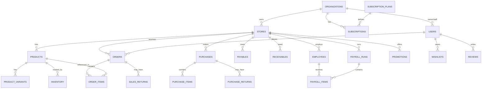

# Database Schema

All tenant-scoped tables below carry `store_id` (and, transitively, sit under an `organization_id`). Platform-level tables (organizations, stores, subscription_plans, subscriptions, users where role=super_admin) are not tenant-scoped.

## 1. Entity list

### Platform-level

**organizations**
- id, name, owner_user_id (FK users), isolation_tier_default (enum: shared/dedicated), created_at

**users**
- id, name, email, phone, password_hash, role (enum: super_admin, org_owner, store_admin, store_staff, customer), organization_id (nullable FK), store_id (nullable FK, for store_admin/staff), created_at

**stores**
- id, organization_id (FK), name, slug (unique, used for subdomain), category (enum: grocery, vegetable, shoe, other), address, latitude, longitude, logo_url, status (enum: pending, approved, rejected, suspended), isolation_tier (enum: shared, dedicated), tenant_db_name (nullable, populated if dedicated), created_at

**subscription_plans**
- id, name (Basic/Pro/Enterprise), price, billing_cycle (monthly/yearly), features_json (list of feature flags this plan unlocks)

**subscriptions**
- id, organization_id (FK), plan_id (FK), status (trialing/active/past_due/cancelled), started_at, current_period_end, next_billing_date

### Tenant-scoped (store_id on every row)

**products**
- id, store_id, name, description, category, sku, image_url
- pricing_type (enum: fixed, weight_based)
- base_price, unit (enum: pcs, kg, g, litre, dozen, other)
- has_variants (bool)
- is_perishable (bool), expiry_date (nullable), batch_number (nullable)
- is_active (bool), created_at

**product_variants**
- id, product_id, variant_type (enum: size, color, other), variant_value, price_override (nullable), stock_qty

**inventory**
- id, store_id, product_id, variant_id (nullable), quantity_on_hand, reorder_level, last_restocked_at

**orders**
- id, store_id, customer_id (FK users), status (enum: pending, confirmed, preparing, out_for_delivery, delivered, cancelled), payment_method (enum: cod, bank_transfer, jazzcash, easypaisa), payment_status (enum: pending, paid, failed, refunded), delivery_address, total_amount, created_at

**order_items**
- id, order_id, product_id, variant_id (nullable), quantity, unit_price, subtotal

**wishlists**
- id, customer_id, product_id, created_at

**reviews**
- id, customer_id, product_id (nullable), store_id (nullable — supports both product and store reviews), rating (1-5), comment, created_at

**purchases** (Enterprise)
- id, store_id, supplier_name, total_amount, status (ordered/received/partially_received), created_at

**purchase_items** (Enterprise)
- id, purchase_id, product_id, quantity, unit_cost

**purchase_returns** (Enterprise)
- id, purchase_id, product_id, quantity, amount, reason, created_at

**sales_returns** (Enterprise)
- id, order_id, order_item_id, quantity, amount, reason, created_at

**payables** (Enterprise)
- id, store_id, vendor_name, amount, due_date, status (unpaid/paid/overdue)

**receivables** (Enterprise)
- id, store_id, customer_id (nullable), amount, due_date, status (unpaid/paid/overdue)

**employees** (Enterprise)
- id, store_id, name, role_title, salary, hire_date, is_active

**payroll_runs** (Enterprise)
- id, store_id, period_month, total_amount, status (draft/processed/paid), processed_at

**payroll_items** (Enterprise)
- id, payroll_run_id, employee_id, base_amount, deductions, net_pay

**expenses** (Enterprise, "other expenses")
- id, store_id, category, amount, description, expense_date

**promotions** (Enterprise)
- id, store_id, name, type (enum: percent_discount, flat_discount, bundle_deal), value, applicable_scope (all/category/specific_products), start_date, end_date, is_active

**notifications**
- id, user_id, title, body, type, related_order_id (nullable), read_at, created_at

## 2. Relationships (ERD, Mermaid)

## 3. Notes on the flexible product model

Per the decision to support all verticals with one schema:
- **Weight-based pricing** (vegetable stores): `pricing_type = weight_based`, `unit = kg/g`. Cart quantity is entered as a decimal weight, not integer count.
- **Size/color variants** (shoe stores): `has_variants = true`, one `product_variants` row per size/color combination, each with its own stock count and optional price override.
- **Perishables** (grocery/vegetable): `is_perishable = true`, `expiry_date` and `batch_number` populated; a scheduled job flags/hides items past expiry and alerts the store admin (see 04-FEATURES-BY-PHASE.md, Inventory).
- A single product can combine flags (e.g. a perishable item that's also weight-based) — the schema does not force mutual exclusivity.
